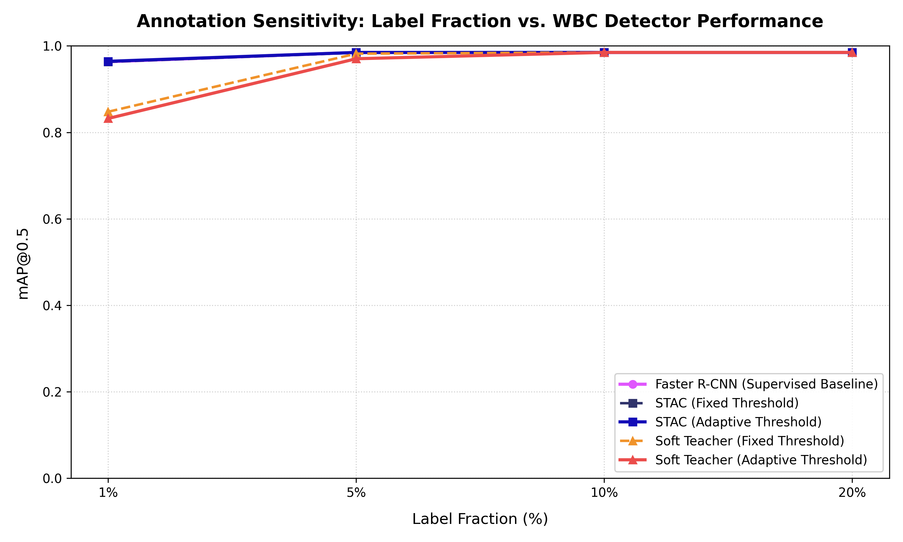
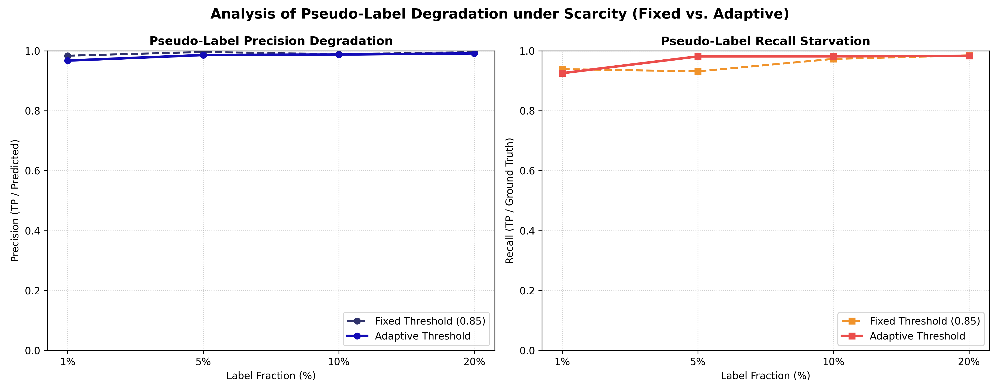

# Semi-Supervised White Blood Cell Detection with Limited Bounding Box Annotations

This repository contains the official implementation of the comparative study: **"Semi-Supervised White Blood Cell Detection with Limited Bounding Box Annotations"**.

The study evaluates and benchmarks semi-supervised object detection (SSOD) methods under varying clinical annotation budgets (1%, 5%, 10%, and 20% labeled data fractions) using the open-access **TXL-PBC dataset**.

---

## 📌 Project Overview
Automated white blood cell (WBC) detection in peripheral blood smear images is a critical preprocessing step for digital hematology. However, training deep learning object detectors requires dense bounding box annotations, which are expensive to acquire. 

This project benchmarks:
1. **Faster R-CNN (Supervised Baseline)** with a MobileNetV3-Large FPN backbone.
2. **STAC-inspired Framework** (Offline pseudo-labeling under fixed and adaptive thresholds).
3. **Soft Teacher-inspired Framework** (Online exponential moving average teacher-student framework under fixed and adaptive thresholds).

The analysis decoupled end-detector performance from pseudo-label quality (Precision/Recall of generated boxes) to investigate the phenomena of **label starvation** and **noise propagation** under extreme annotation scarcity.

---

## 📂 Repository Structure
*   `dataset.py`: Handles deterministic splitting, YOLO-to-absolute bounding box coordinate conversion, and weak/strong data augmentation pipelines.
*   `models.py`: Initializes the Faster R-CNN detector with MobileNetV3-Large FPN backbone and custom classification heads.
*   `pseudo_labeling.py`: Code for generating pseudo-labels using fixed or statistical adaptive thresholds, and evaluating pseudo-label quality against hidden ground truths.
*   `train.py`: Contains training loops and evaluation engines for Supervised Baseline, STAC, and Soft Teacher.
*   `run_experiments.py`: Orchestration script to run all 20 configurations (5 methods × 4 fractions) sequentially.
*   `plot_results.py`: Utility to generate comparative performance plots and summary tables.
*   `results.json`: Database containing all performance and pseudo-label quality metrics.
*   `results_table.md`: Formatted markdown summary of the experimental results.
*   `paper_draft_outline.md`: Outline and text of the academic paper draft.
*   `sensitivity_comparison.png`: Visualization of annotation sensitivity vs. detector performance.
*   `pseudo_label_quality.png`: Visualization of pseudo-label precision degradation and recall starvation.

---

## 🛠️ Installation & Setup
1. **Clone the Repository:**
   ```bash
   git clone https://github.com/fdmylcn/WBC_Detection_ECE664.git
   cd WBC_Detection_ECE664
   ```

2. **Set up Virtual Environment & Install Dependencies:**
   ```bash
   python -m venv venv
   # On Windows:
   venv\Scripts\activate
   # On Linux/macOS:
   source venv/bin/activate
   
   pip install -r requirements.txt
   ```

3. **Dataset Preparation:**
   Extract the **TXL-PBC dataset** into a folder named `TXL-PBC_Dataset` inside the repository root. Ensure the path is structured as:
   `d:/assignment/TXL-PBC_Dataset/TXL-PBC/`

---

## 🚀 Running the Experiments
To execute the full benchmarking pipeline across all label ratios (1%, 5%, 10%, 20%) and methods:

```bash
python run_experiments.py
```

*Note: You can configure `QUICK_RUN = True` inside `run_experiments.py` for a fast CPU-based debug run (takes less than 3 minutes).*

To regenerate the results plots and tables after running the experiments:
```bash
python plot_results.py
```

---

## 📊 Experimental Results

Below is the summary of the experimental results obtained on the TXL-PBC test set:

| Method & Strategy              | Fraction | Test mAP@0.5 | Test mAP@0.5:0.95 | Test Precision | Test Recall | Pseudo-Label Precision | Pseudo-Label Recall |
| -----------------              | -------- | ------------ | ----------------- | -------------- | ----------- | ---------------------- | ------------------- |
| Faster R-CNN (Supervised Baseline) | 1%       | 0.9634       | 0.7148           | 0.9275         | 0.9624      | -                      | -                   |
|                                | 5%       | 0.9850       | 0.7189           | 1.0000         | 0.9624      | -                      | -                   |
|                                | 10%      | 0.9848       | 0.7358           | 0.9850         | 0.9850      | -                      | -                   |
|                                | 20%      | 0.9848       | 0.8118           | 0.9848         | 0.9774      | -                      | -                   |
| STAC (Fixed Thresh = 0.85)     | 1%       | 0.9632       | 0.5761           | 0.9846         | 0.9624      | 0.9837                 | 0.9389              |
|                                | 5%       | 0.9841       | 0.6578           | 0.9353         | 0.9774      | 0.9963                 | 0.9316              |
|                                | 10%      | 0.9850       | 0.7673           | 0.9924         | 0.9850      | 0.9888                 | 0.9731              |
|                                | 20%      | 0.9849       | 0.8022           | 1.0000         | 0.9774      | 0.9958                 | 0.9848              |
| STAC (Adaptive Thresh)         | 1%       | 0.9644       | 0.6354           | 0.9773         | 0.9699      | 0.9675                 | 0.9256              |
|                                | 5%       | 0.9849       | 0.7205           | 0.9776         | 0.9850      | 0.9860                 | 0.9815              |
|                                | 10%      | 0.9850       | 0.7555           | 0.9924         | 0.9850      | 0.9877                 | 0.9816              |
|                                | 20%      | 0.9850       | 0.7567           | 1.0000         | 0.9850      | 0.9916                 | 0.9834              |
| Soft Teacher (Fixed Thresh = 0.85) | 1%       | 0.8477       | 0.4669           | 0.9365         | 0.4436      | -                      | -                   |
|                                | 5%       | 0.9821       | 0.6891           | 0.9922         | 0.9549      | 1.0000                 | 0.0058              |
|                                | 10%      | 0.9850       | 0.7136           | 1.0000         | 0.9699      | -                      | -                   |
|                                | 20%      | 0.9850       | 0.7406           | 1.0000         | 0.9774      | -                      | -                   |
| Soft Teacher (Adaptive Thresh) | 1%       | 0.8322       | 0.2737           | 0.1527         | 0.9699      | 0.1500                 | 0.9811              |
|                                | 5%       | 0.9704       | 0.6465           | 0.3696         | 0.9699      | 0.3502                 | 0.9780              |
|                                | 10%      | 0.9850       | 0.8133           | 0.9924         | 0.9850      | 0.9793                 | 0.9865              |
|                                | 20%      | 0.9850       | 0.8323           | 1.0000         | 0.9850      | 0.9903                 | 0.9890              |

---

## 📈 Visualizations

### 1. Annotation Sensitivity Curves


### 2. Pseudo-Label Quality Degradation (Fixed vs. Adaptive)


---

## 🎓 Citation & Reference
If you use this codebase or refer to the findings in your academic work, please cite:
```bibtex
@article{yalcin2026semi,
  title={Semi-Supervised White Blood Cell Detection with Limited Bounding Box Annotations},
  author={Yal{\c{c}}in, Fadime},
  journal={Department of Electrical and Computer Engineering, Abdullah G{\"u}l University},
  year={2026}
}
```
